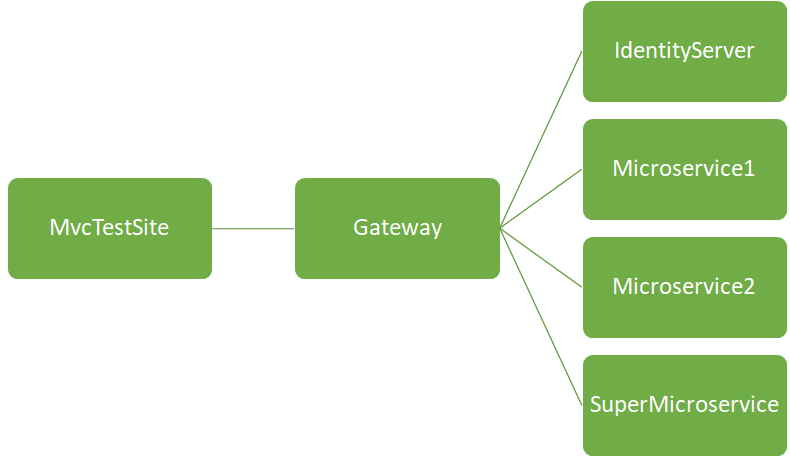
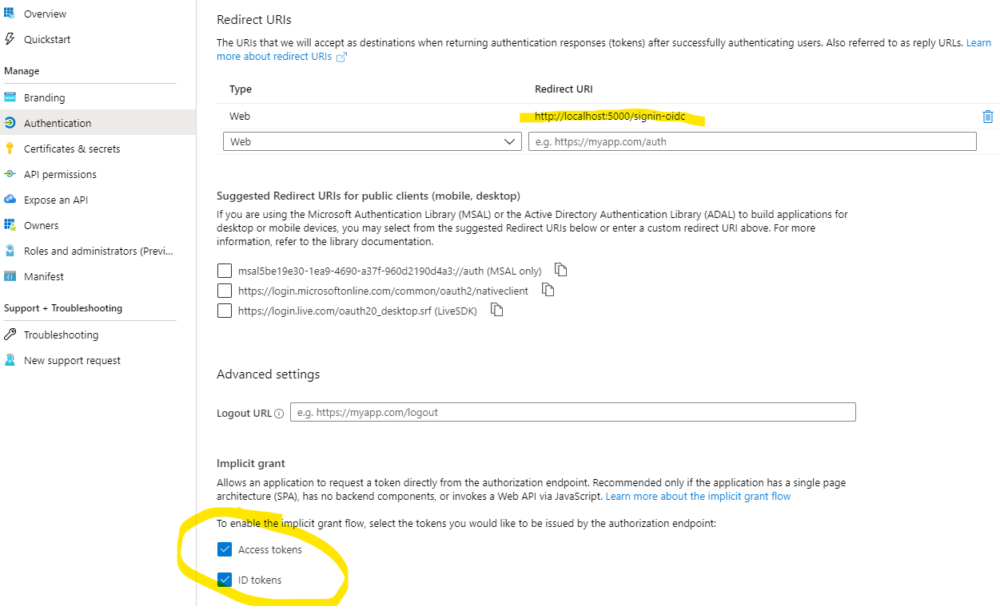

# Ocelot & IdentityServer & AzureAD

Demo for a scenario where the following tools are used:

* Ocelot Gateway (Gateway.sln)
* Microservices behind the Ocelot Gateway (Microservices.sln)
* Website in front of the Ocelot Gateway (MvcTestSite.sln) 
* IdentityServer (IdentityServer.sln)
* Azure AD

Requires .NET Core SDK 3.1.100.

The following services are behind the Ocelot:
* Microservice1
* Microservice2
* SuperMicroservice
* IdentityServer

MvcTestside sits in front of the Gateway.

## Permissions

By default the following permissions are applied:

* Microservice1 can call Microservice2 but not SuperMicroservice.
* Microservice2 can call Microservice1 but not SuperMicroservice.
* SuperMicroservice can call Microservice1 and Microservice2.
* MvcTestSite's client can call Microservice1 and Microservice2 but not SuperMicroservice.
* MvcTestSite's Azure AD signed user can call Microservice1, Microservice2 and SuperMicroservice.

## Testing

Use *MvcTestSite* to test microservices calling each other. The same site can be used to test Azure Ad sign-in and the calling of a microservice through the gateway.

Run the solutions in the following order:

1. Microservices (should start Microservice1, Microservice2 and SuperMicroservice in the following ports: 44392, 44393, 44394)
2. Gateway (https://localhost:44334/)
3. IdentityServer (http://localhost:5000/)
4. MvcTestSite (https://localhost:44322/)

Use "Privacy"-page to sign-in with Azure AD and to call the Supermicroservice.

## Azure Ad configuration
Create a new Azure AD app registration:

Copy the Azure Ad application settings to IdentityServer/Startup.cs.
